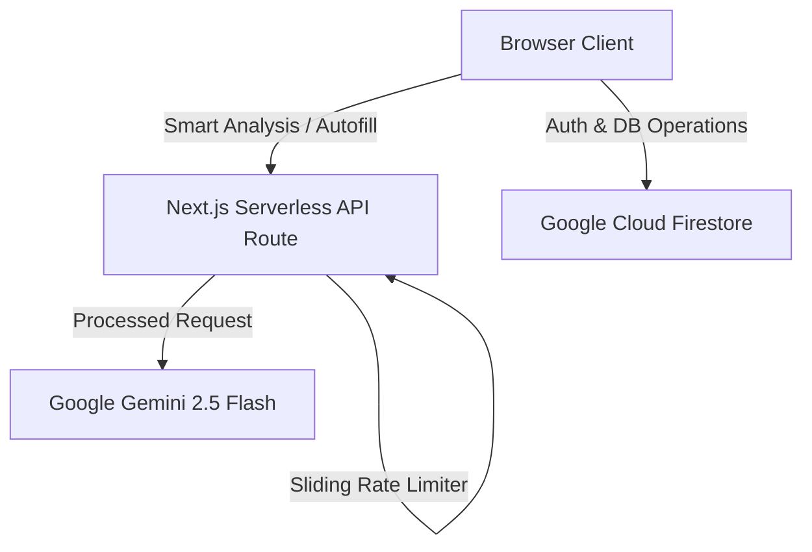
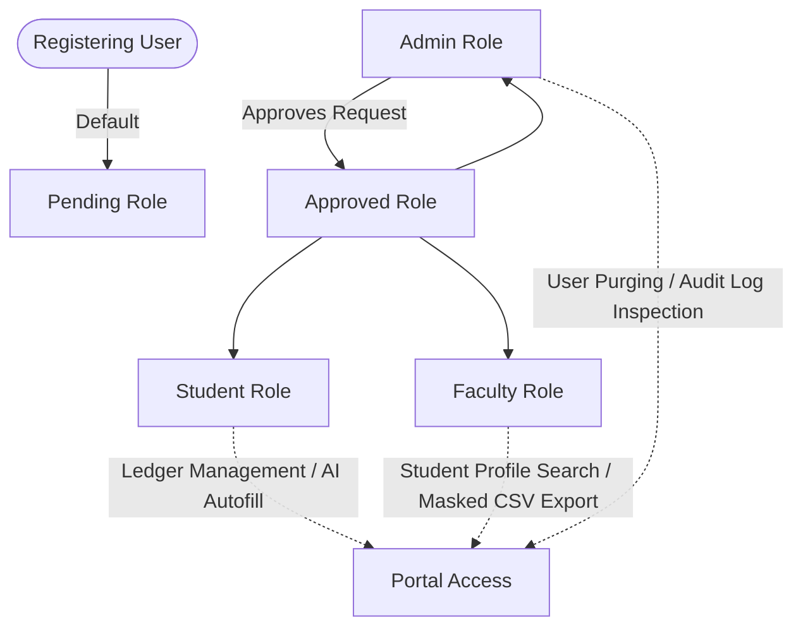

# Department Ledger Portal

[](https://nextjs.org/)
[](https://firebase.google.com/)
[](https://ai.google.dev/)
[](https://tailwindcss.com/)
[](.github/workflows/ci.yml)

A production-grade, secure academic ledger platform for university departments. The system centralizes student progression records, faculty review workflows, administrative governance actions, and AI-assisted portfolio analysis using a strict client/server cryptographic role model and Firestore-backed data.

- **Live Demo**: [department-ledger-portal.vercel.app](https://department-ledger-portal.vercel.app)
- **Hackathon Deck**: [docs/GDG_Solution_Challenge_Solution_PPT_Final.pdf](docs/GDG_Solution_Challenge_Solution_PPT_Final.pdf)
- **Prototype Video**: [Video Recording Link](https://drive.google.com/drive/folders/1a2Bklmxa7QwUcPPeY83r4hymXAEa6kbX)

---

## Table of Contents
1. [What This Project Solves](#1-what-this-project-solves)
2. [Product Capabilities](#2-product-capabilities)
3. [Architecture Overview](#3-architecture-overview)
4. [Tech Stack](#4-tech-stack)
5. [Role and Access Model](#5-role-and-access-model)
6. [Repository Structure](#6-repository-structure)
7. [API Surface](#7-api-surface)
8. [Data Model](#8-data-model-collections)
9. [Security Model](#9-security-model)
10. [Local Development Setup](#10-local-development-setup)
11. [Environment Variables](#11-environment-variables)
12. [Scripts](#12-scripts)
13. [Testing and Quality Gates](#13-testing-and-quality-gates)
14. [CI/CD Pipeline](#14-cicd)
15. [Deployment Checklist](#15-deployment)
16. [Operations and Troubleshooting](#16-operations-and-troubleshooting)

---

## 1. What This Project Solves

Departments often manage student progression across multiple disconnected tools. Department Ledger Portal provides a unified, secure platform for:
* **Student Record Management**: Single source of truth for academic profiles.
* **Faculty Review Workflows**: Interface for student search, filtering, and validation.
* **Administrative Governance**: Access approval dashboards and account auditing.
* **AI-Assisted Operations**: Automated section autofill and profile readiness analysis.
* **Immutable Auditing**: Append-only transaction logging to guarantee action non-repudiation.
 
---

## 2. Product Capabilities

### Student Ledger Management
* **Ledger Sections**: Manage academics, achievements, activities, placements, projects, and skills.
* **Smart Autofill**: Upload proof documents (PDFs/images) to trigger AI-assisted section inputs.
* **Career Pulse**: Generate detailed AI readiness evaluations outlining strengths and roadmaps.
* **PDF Exporter**: Compile verified resumes and credential portfolios into unified PDFs.
* **Privacy Controls**: Submit deletion requests to purge personal records.

### Faculty Verification
* **Student Search**: Advanced filtering by branch, year, and search keywords.
* **Ledger Review**: Review student portfolios, grades, and uploaded certificates.
* **Masked Exports**: Export datasets as CSV with masked PII (emails/phone numbers) for general staff use.

### Admin Governance
* **Access Gating**: Approve pending role registration requests.
* **User Purging**: Execute cascade user deletes utilizing atomic transaction batches.
* **Auditing**: Review write-only, append-only logs of critical administrative actions.

---

## 3. Architecture Overview

### System Data Flow


### Key Architectural Patterns
* **Frontend**: Next.js Pages Router with React 19 and Tailwind CSS 4. Route guards are evaluated synchronously inside client layouts to prevent layout flash during page switches.
* **Web Worker Offloading**: High-volume data exports (CSV downloads) are offloaded to Web Workers (`public/workers/csv-worker.js`) to keep the browser UI thread free.
* **Serverless Backend**: Gated API endpoints with early CORS verification and cryptographic verification of Firebase ID JWTs using Google public certificate stores.
* **Security Headers**: Standard headers like Content Security Policy, `X-Frame-Options: DENY`, `X-Content-Type-Options: nosniff`, and HSTS are configured in `next.config.mjs` and optimized to bypass Next.js internal static assets.
* **Firestore Index Fallback**: If query indexing fails during local/staging environments, data utilities query simpler batches and perform local filtering in-memory to prevent interface locks.

---

## 4. Tech Stack

* **Frontend Framework**: Next.js, React
* **Styling Engine**: Tailwind CSS
* **Database & Auth**: Firebase Auth + Cloud Firestore
* **Server Auth SDK**: firebase-admin
* **GenAI Engine**: @google/generative-ai
* **Testing Engines**: Jest + fast-check (property-based) + Playwright (E2E)
* **CI/CD Platform**: GitHub Actions
* **Required Runtime Node Engine**: `>=20.19.0` or `>=22.13.0`

---

## 5. Role and Access Model

### Governance Lifecycle


### Route Authorization Matrix
Defined in `lib/route-access.js`:
* `PUBLIC`: Visible to everyone (e.g. index landing pages).
* `GUEST`: Only visible when signed out (e.g. `/login`, `/register`).
* `AUTH`: Requires any validated user profile with an approved role.
* `STUDENT`: Requires role `"student"`.
* `STAFF`: Requires role `"faculty"` or `"admin"`.
* `ADMIN`: Requires role `"admin"`.

---

## 6. Repository Structure

```text
.
├── .github/workflows/          # CI pipeline definition
├── __tests__/                  # Unit, API integration, and property-based test suites
├── e2e/                        # Playwright smoke and auth journey specs
├── components/                 # React UI layout and dashboard files
│   └── ui/                     # Reusable UI primitives (Buttons, Modals, Badges)
├── pages/                      # Next.js router pages
│   └── api/                    # Serverless backend controllers
├── lib/                        # Auth, Firestore connections, and validation utilities
├── firebase/                   # Firestore security rule definitions and indexes
├── public/                     # Static media and web worker modules
└── docs/                       # Project API contract and hackathon deck
```

---

## 7. API Surface

All requests must send `Content-Type: application/json` and include a Bearer Firebase token:
`Authorization: Bearer <firebase-id-token>`

### `GET /api/health`
* **Auth Required**: No.
* **Return status**: `200` (OK) or `503` (Degraded).
* **Details**: Evaluates environment configuration keys. Providing matching request header `x-health-debug-token` returns granular configurations.

### `POST /api/autofill-section`
* **Auth Required**: Yes.
* **Rate Limits**: 10 requests / user / minute.
* **Request Payload**:
```json
{
  "section": "project",
  "existingData": [],
  "fileData": "base64-string",
  "fileMimeType": "application/pdf"
}
```
* **Response status**: `200` (AI returned extracted schema matching section) or `403` (Disallowed Origin) or `429` (Rate limit / Quota).

### `POST /api/analyze-readiness`
* **Auth Required**: Yes.
* **Rate Limits**: 5 requests / user / minute.
* **Request Payload**:
```json
{
  "profile": { "name": "Student", "branch": "CSE" },
  "academic": [],
  "activities": [],
  "achievements": [],
  "placements": [],
  "projects": [],
  "skills": []
}
```
* **Response status**: `200` (JSON object containing `score`, `strengths`, `weaknesses`, `recommendations`, `careerRoadmap`).

---

## 8. Data Model (Collections)

Primary Firestore collections used:
* `users`: Main credentials and role details.
* `roleRequests`: Signup request validation queue.
* `deletionRequests`: User deletion requests waiting for admin approval.
* `notifications`: User notification dashboard queue.
* `auditLogs`: Administrative operation log.
* **Ledger sub-collections**: `academicRecords`, `activities`, `achievements`, `placements`, `projects`, `skills`, `aiReports`, `uploadedDocuments`.

Collection Constants defined in `lib/constants.js`.

---

## 9. Security Model

* **Cryptographic Verification**: Incoming JWT tokens are checked directly on the serverless backend using Google's x509 public certificates.
* **Gated CORS Rejection**: Validates request origin headers on API route gateways immediately. Returns `403 Forbidden` on disallowed domains, protecting Gemini credit quotas.
* **Role-Based Gating**: Custom database controls defined in `firebase/firestore.rules` protect records from unauthorized cross-user modifications.
* **Cascade Deletion Batching**: User deletes utilize `writeBatch` in Firestore to atomically delete all sub-collection ledger entities or revert entirely.
* **PII Masking**: CSV generation automatically masks user phone numbers and emails for general faculty downloads. Admins receive unmasked data.
* **Immutable Audits**: Firestore rules prevent update or delete actions on the `auditLogs` collection (`allow update: if false; allow delete: if false`).

---

## 10. Local Development Setup

### Prerequisites
* Node.js (Node 20 or Node 22)
* npm
* A Google Firebase Project

### Setup Guide
1. Clone the repository:
```bash
git clone https://github.com/tanish-jain-225/Department-Ledger-Portal
cd Department-Ledger-Portal
```
2. Install dependencies:
```bash
npm install
```
3. Copy environment configuration:
```bash
copy .env.local.example .env.local
```
4. Set up your values in `.env.local`.
5. Spin up the development server:
```bash
npm run dev
```

---

## 11. Environment Variables

Template defined in `.env.local.example`.

```env
# Client Configuration (Shared)
NEXT_PUBLIC_FIREBASE_API_KEY=
NEXT_PUBLIC_FIREBASE_AUTH_DOMAIN=
NEXT_PUBLIC_FIREBASE_PROJECT_ID=
NEXT_PUBLIC_FIREBASE_STORAGE_BUCKET=
NEXT_PUBLIC_FIREBASE_MESSAGING_SENDER_ID=
NEXT_PUBLIC_FIREBASE_APP_ID=

# Server Configuration (Private)
GEMINI_API_KEY=
GEMINI_MODEL=gemini-2.5-flash

# Optional Controls
HEALTHCHECK_DEBUG_TOKEN=
RATE_LIMIT_STORE=shared
ALLOWED_ORIGIN=https://your-production-app.vercel.app
```

---

## 12. Scripts

* `npm run dev`: Start Next.js hot-reload development server.
* `npm run build`: Compile Next.js production bundles.
* `npm run start`: Start compiled production server.
* `npm run lint`: Execute ESLint formatting checks.
* `npm test`: Run Jest unit and property-based test suites.
* `npm run test:e2e`: Run Playwright browser integration tests.

---

## 13. Testing and Quality Gates

### Current Validation Status
* **Jest**: 84+ passing tests across 17 suites.
* **Playwright**: 5+ passing smoke tests.
* **Lint**: Pass.
* **Build**: Pass.

### Quality Parameters
* **Unit Testing**: Tests validation helpers, navigation routing, and token authorization processes (`__tests__/apiAuth.test.js`).
* **Component Testing**: Tests UI primitives (Buttons, Modals, EmptyStates) using React Testing Library.
* **Property-Based Testing**: Employs `fast-check` to verify mathematical invariants on rates, analytics calculators, and prompts against hundreds of randomized inputs.
* **Route Integration Testing**: Simulates mock server requests verifying rate-limiting status codes and CORS gating triggers.
* **E2E Smoke Testing**: Runs browser scripts simulating registrations, responsive layouts, page transfers, and route guard redirects.

---

## 14. CI/CD

Pipeline defined in `.github/workflows/ci.yml`.

Runs automatically on push, pull-requests, or manual triggers:
1. Installs dependencies using `npm ci`.
2. Audits production vulnerabilities (`npm audit --omit=dev --audit-level=high`).
3. Runs ESLint checks.
4. Executes unit and property-based tests across a Matrix (Node 20 and Node 22).
5. Compiles production assets (`npm run build`).
6. Executes Playwright E2E checks in a separate clean runner.

---

## 15. Deployment

Recommended environments:
* **Hosting**: Vercel.
* **Database & Auth**: Google Firebase console.

### Deployment Process
1. Set up hosting project dashboard.
2. Configure environment keys.
3. Deploy Firestore rules and index configurations:
```bash
firebase deploy --only firestore:rules,firestore:indexes
```
4. Verify deployment health endpoint returns `200`:
`https://your-app.vercel.app/api/health`

---

## 16. Operations and Troubleshooting

### System Log Surveillance
API endpoints log operational alerts directly to server logs:
* `[Auth Audit] JWT verification failed`: Indicates expired or corrupted JWT signature attempts.
* `[Rate Limit Audit]`: Logs users who hit rate limiter thresholds.
* `[API Error Audit]`: Logs details of LLM exceptions or payload parse faults.
* `[CORS Audit]`: Logs origin header mismatches when blocking cross-origin triggers.

### Troubleshooting Scenarios

#### API calls fail with 403 Forbidden
* Verify the browser request headers match your configured `ALLOWED_ORIGIN` env variable. Localhost bypasses this check automatically.

#### AI parsing fails or returns malformed structures
* The parsing engine resolves unbalanced brackets. However, if the Gemini API has network issues, standard HTTP codes (`429`/`503`/`504`) are returned. Check health logs for API keys.

#### Unauthorized errors (401)
* Ensure requests include a valid Bearer token. Ensure your Firebase project ID in `NEXT_PUBLIC_FIREBASE_PROJECT_ID` is set correctly.
