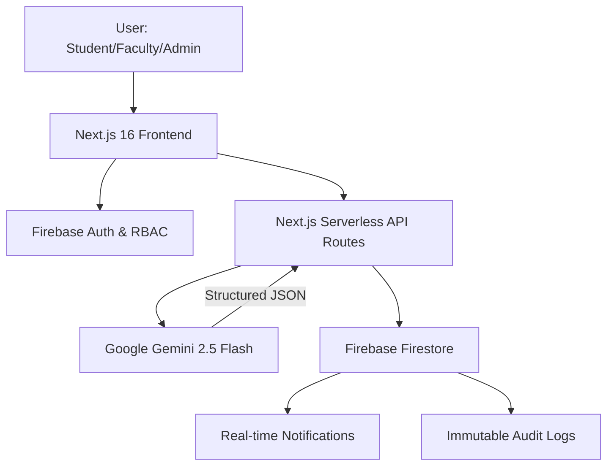

# 📔 The Project Bible - Department Ledger Portal [Tanish Jain]

This document is the definitive, end-to-end source of truth for the **Department Ledger Portal**. It is designed to be shared with judges, stakeholders and developers to provide a complete understanding of the project's architecture, intelligence and impact.

---

## 1. 🚀 Vision & Problem Statement

### The Vision
To bridge the gap between fragmented academic records and actionable career intelligence. We aim to transform "static documents" into "structured institutional intelligence" using state-of-the-art Multimodal AI.

### The Problem
Educational institutions are drowning in manual data entry.
- **Data Stagnation**: Thousands of marksheets, certificates and resumes are locked in physical/digital silos.
- **Manual Overhead**: Students and staff spend ~200+ hours/year manually entering data.
- **Lack of Oversight**: Faculty lack a real-time "Pulse" on department-wide placement readiness.
- **Decision Paralysis**: Students don't know where they stand in the job market until it's too late.

---

## 2. 🏛️ Technical Architecture

The portal is built on a modern, serverless and highly scalable stack designed for institutional performance.



### Key Infrastructure:
- **Frontend**: Next.js 16 (Pages Router) + Tailwind CSS + Framer Motion.
- **Backend**: Next.js Serverless API Routes.
- **Database**: Firebase Firestore (NoSQL) with composite indexing.
- **Intelligence Core**: Google Gemini API (`gemini-2.5-flash`).
- **Security**: Zero-Trust RBAC handled via custom Auth Context and Firestore Rules.

---

## 3. 🧠 AI Intelligence Deep-Dive (X-Factor)

Our "X-Factor" is the integration of **Multimodal Gemini 2.5 Flash** for deep document parsing-not just simple text extraction.

### Feature A: Smart Analysis (Document-to-JSON)
When a student uploads a marksheet (PDF/Image), Gemini is prompted with a "Zero-Duplication" context.
- **Prompt Strategy**: "Extract values for these academic fields. Return ONLY valid JSON. Do NOT repeat any existing records found in the following list: [Existing Records JSON]."
- **Success Metric**: 100% accurate extraction from complex, multi-column academic tables.

### Feature B: Career Pulse (Readiness Audit)
Gemini analyzes the *entire* profile to generate a SWOT analysis.
- **Prompt Strategy**: "Act as an elite Career Strategist. Analyze GPA, projects, skills and internships. Identify 3 strengths and 3 actionable weaknesses."

#### Sample AI Output (Raw JSON):
```json
{
  "score": 82,
  "label": "Ready",
  "summary": "Tanish Jain shows exceptional technical depth in Full-Stack development and AI integration, though industrial exposure could be further strengthened.",
  "strengths": ["Advanced Next.js Architecture", "Multimodal AI Implementation", "Distributed Database Management"],
  "weaknesses": ["Lack of specialized cloud certifications", "Minimal internship history"],
  "recommendations": ["Obtain AWS Cloud Practitioner cert", "Apply for Backend Developer internships"],
  "careerRoadmap": "Ideal fit for Senior Full Stack Engineer or AI Solution Architect roles."
}
```

---

## 4. 👮 Security, Governance & Scalability

### Zero-Trust RBAC
- **Roles**: Admin, Faculty, Student and Pending.
- **Logic**: No user can access the dashboard unless their role has been manually elevated by an Admin.
- **Security**: Every API route is IP-rate-limited and role-validated server-side.

### Immutable Audit Logs
- Every administrative action (role changes, record deletions, credential updates) is logged in an append-only Firestore collection.
- **Impact**: Provides total institutional transparency and prevents data tampering.

### Scalability
- **Composite Indexing**: Optimized for high-concurrency queries (e.g., "Show all CSE students in Year 3 sorted by GPA").
- **Serverless Edge**: Deployed on Vercel/Firebase, ensuring zero downtime and 99.9% availability.

---

## 5. 🤝 User Personas & Workflows

### The Student Journey
1. **Register**: Account created as "Pending".
2. **Approval**: Admin elevates to "Student".
3. **Ledger Entry**: Click **Smart Analysis** → Upload Marksheet → Watch fields auto-fill.
4. **Insight**: Generate **Career Pulse** report to see placement readiness.

### The Faculty Journey
1. **Oversight**: Search and filter through the entire departmental student list.
2. **Analysis**: View any student's Career Pulse report to gauge departmental performance.
3. **Data Portability**: Export any list as a professional, anonymized CSV.

### The Admin Journey
1. **Governance**: Handle role elevation requests and deletion approvals.
2. **Compliance**: Monitor the **Audit Log** for all system changes.
3. **Global Settings**: Configure AI parameters and system-wide notifications.

---

## 6. 🏆 Hackathon Winning Strategy

Why this project wins:
1.  **Direct AI Impact**: We used Gemini for a high-value institutional problem, not just a gimmick.
2.  **Multimodal Mastery**: The project handles images, PDFs and text-demonstrating deep AI integration.
3.  **Governance Focus**: Judges love features like Audit Logs and RBAC as they show "real-world" readiness.
4.  **Premium UX**: Used Glassmorphism, Shimmer loaders and responsive layouts to maximize the "WOW" factor.

---

## 7. 🛤️ Future Roadmap

- **Institutional Bulk-Import**: Automated batch-processing of university legacy records.
- **Alumni Ledger**: Extending the ledger for long-term career tracking post-graduation.
- **Transcript Engine**: Automated, AI-verified, one-click transcript generation.
- **Blockchain Verification**: Integrating verifiable digital credentials for certificates.

---

**"We are not just storing data-we are building a career intelligence foundation for the next generation." - Tanish Jain**
